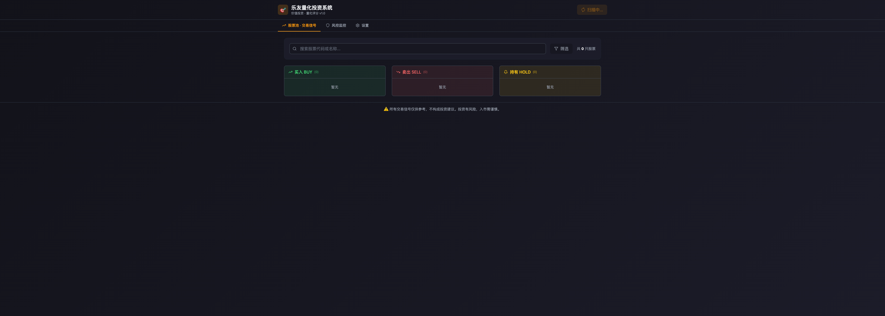
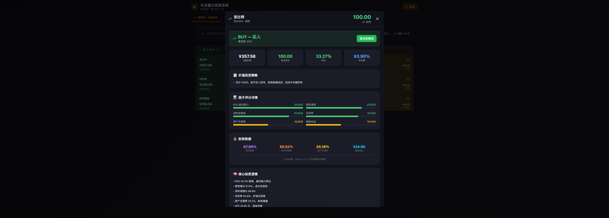
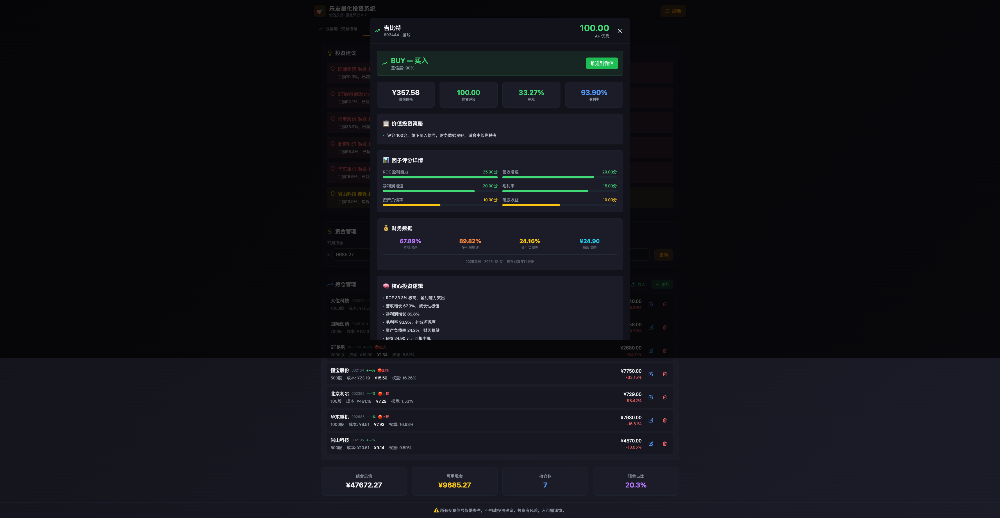

# 🎯 LeyoQuant - 乐友量化投资系统

> 基于价值投资理念的A股量化分析与风险管理平台

## 📸 页面预览

### 股票池 · 交易信号


### 个股分析详情


### 风控监控


---

## 📋 功能特性

- **多因子量化评分** — 7因子价值投资模型，综合评估股票投资价值
- **实时行情监控** — 接入新浪财经实时数据，覆盖126+只A股蓝筹
- **技术分析引擎** — MACD/RSI/KDJ/布林带/均线等5大技术指标
- **策略回测系统** — 5种策略回测对比，自动推荐最优参数
- **风险管控监控** — 持仓追踪、仓位预警、组合分析
- **交易信号推送** — 买入/卖出/持有三栏展示，支持微信推送

## 🏗️ 技术栈

| 层级 | 技术 |
|------|------|
| 前端 | React + Vite + TailwindCSS |
| 后端 | Python FastAPI |
| 数据源 | 新浪财经 / 东方财富 |

## 🚀 快速开始

```bash
# 克隆项目
git clone https://github.com/richard3153/leyo-quant.git
cd leyo-quant

# 启动后端
cd backend
pip install -r requirements.txt
python main.py

# 启动前端（新终端）
cd frontend
npm install
npm run dev
```

## 📄 版权声明

© 2025 杭州市上城区乐友信息服务工作室（个体工商户） 版权所有

本项目受中华人民共和国著作权法保护。未经版权所有者书面授权，不得以任何形式复制、
修改、分发或以其他方式使用本项目的任何部分。

---

**LeyoQuant** 是由 杭州市上城区乐友信息服务工作室 独立开发并拥有完全知识产权的
量化投资分析软件。该软件的所有源代码、文档、设计及相关资源均受法律保护。

对于商业合作或授权咨询，请通过 GitHub Issues 联系。

## 📜 License

MIT License

---

© 2025 杭州市上城区乐友信息服务工作室 All Rights Reserved.
